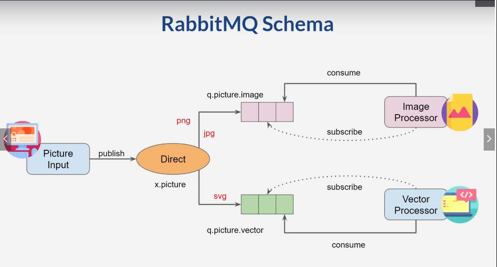

= RabbitMQ & Quarkus Camel for System Integration

* Setup RabbitMQ over Docker

.Only Linux Usage
[source,bash]
----
docker run -d --name rabbitmq --restart always \
  --hostname docker-rabbitmq -p 5672:5672 -p 15672:15672 \
  -v /Users/dougdb/.docker_volumes/rabbitmq:/var/lib/rabbitmq/mnesia rabbitmq:management
----

== Links

* https://code.quarkus.io/[Code in Quarkus]
* https://camel.apache.org/components/3.11.x/rabbitmq-component.html#_uri_format[Apache Camel RabbitMQ]
* https://camel.apache.org/components/3.11.x/rabbitmq-component.html[RabbitMQ Camel Component]
* http://events17.linuxfoundation.org/sites/events/files/slides/CloudNativeCamelDesignPatterns.pdf[Cloud Native Apache Camel Design Patterns]

== Basic Concepts

. Queue is a buffer that stores a message, before any consumer take it
. Exchange routing a message to correct queue
. Routing key is a key that the exchange looks at to decide how to route the message for a queue(s)
. Binding is a link that connects exchange to queue(s)
. Distributed message to queue(s)
. Copy message if required
. Based on message routing key
. Several type of exchanges
. Binding: correlation between exchange - queues

=== Kinds of Exchange

==== Fanout
.. Multiple queues of single message
.. Broadcast to all queues bound to it
.. Copy and send messages to all queues
.. Fanout Sample Configuration
.. Fanout can be compared with AWS SQS

[source,json]
----
{
  "exchange_name":  "exg.fanout.hr",
  "queues": [
    {
      "queue_name": "rmq.accounting.hr"
    },
    {
      "queue_name": "rmq.marketing.hr"
    }
  ]
}
----

==== Direct

.. Send Selective queues(s)
.. Based on Routing key
.. Message can be discarded

[source,json]
----
{
  "exchange_name":  "exg.direct.sales",
  "routing_key": "[apple, android]",
  "queues": [
    {
      "queue_name": "rmq.sales.adr"
    },
    {
      "queue_name": "rmq.sales.apl"
    }
  ]
}
----

.Direct Exchange Pattern using Dynamic Routing Key

* Apache Camel Routing Key Header to Producer Endpoint Raw sample

[source, java]
----
.marshal().json(JsonLibrary.Jackson)
.setHeader("CamelRabbitmqRoutingKey", jsonpath("$.kind"))
.to("{{my.rabbitmq.sales.producer}}")
----

==== Topic

.. Send Selective queues(s) with filtered expressions
.. Based on Routing key
.. Message can be discarded

[source,json]
----
{
  "exchange_name":  "exg.topic.images",
  "queues": [
    {
      "queue_name": "rmq.pic.image",
      "routing_key": ["#.jpg", "*.*.png"]
    },
    {
      "queue_name": "rmq.pic.vector",
      "routing_key": ["*.*.svg"]
    },
    {
      "queue_name": "rmq.pic.filter",
      "routing_key": ["mobile.#"]
    },
    {
      "queue_name": "rmq.pic.log",
      "routing_key": ["*.large.svg"]
    }
  ]
}
----

== Dead Letter Configuration Camel RabbitMQ Spring Equivalent

.Spring Boot DLQ RabbitMQ Sample (acknowledge-mode: manual in properties Or yaml)
[source,java]
----
@RabbitListener(queues="q.pic")
public void listen(String message, Channel channel, @Header(AmqpHeaders.DELIVERY_TAG) long tag) {
  if (myBodyIsInvalid) {
    channel.basicReject(tag, false);
    return;
  }

  channel.basicAck(tag, false);
}
----

.Apache Camel DLQ RabbitMQ Sample

.Producer Side
[source,java]
----
from("direct:foo")
  .setHeader("CamelRabbitmqRequeue", constant(false))
  .marshal().json(JsonLibrary.Jackson)
  .to("{{my.rabbitmq.fanout.queue.producer}}");
----
[source, properties]
----
my.producer.prop=rabbitmq:x.pic?addresses=&queue=q.pic&\
  autoDelete=false&exchangeType=fanout&deadLetterExchange=x.pic.dlq&deadLetterExchangeType=fanout&\
  deadLetterQueue=q.pic.dlq
----

.Consumer Side (Basic only Props or Yaml config is necessary)
[source, properties]
----
my.consumer.prop=rabbitmq:x.pic?addresses=&queue=q.pic&\
  autoDelete=false&exchangeType=fanout&\
  deadLetterExchange=x.pic.dlq&deadLetterExchangeType=fanout&\
  deadLetterQueue=q.pic.dlq&\
  concurrentConsumers=3&threadPoolSize=5&\
  reQueue=true&autoAck=false
----